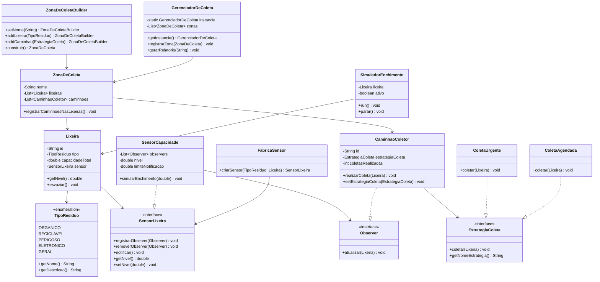

# Sistema de Coleta de Lixo Inteligente para Cidades Inteligentes

## • Descrição do Projeto

Este projeto implementa um **módulo de Coleta Seletiva de Lixo Inteligente** como parte de um simulador de cidades inteligentes com foco em sustentabilidade. O sistema gerencia lixeiras inteligentes equipadas com sensores de capacidade, caminhões de coleta com diferentes estratégias e zonas de coleta organizadas.

## • Escopo do Trabalho

O módulo trata especificamente do gerenciamento inteligente de resíduos urbanos, incluindo:

- Monitoramento em tempo real do nível de lixeiras
- Notificação automática quando lixeiras atingem capacidade limite
- Diferentes estratégias de coleta (urgente e agendada)
- Organização por zonas de coleta
- Geração de relatórios de desempenho

## • Funcionalidades Implementadas

1. **Monitoramento Inteligente**: Sensores detectam o nível de enchimento das lixeiras
2. **Notificações Automáticas**: Sistema Observer notifica caminhões quando coleta é necessária
3. **Estratégias de Coleta**: Permite escolher entre coleta urgente ou agendada
4. **Simulação Automática**: Threads simulam o enchimento gradual das lixeiras
5. **Gestão por Zonas**: Organização de lixeiras e caminhões por áreas da cidade
6. **Relatórios**: Geração de relatórios em arquivo texto com estatísticas
7. **Interface Interativa**: Menu console para controle da simulação

## Arquitetura e Padrões de Projeto

#### 1. **Observer**

- **Onde**: `SensorLixeira` (Subject) e `CaminhaoColetor` (Observer)
- **Por quê**: Permite que caminhões sejam notificados automaticamente quando lixeiras atingem capacidade limite
- **Classes**: `Observer.java`, `SensorLixeira.java`, `SensorCapacidade.java`, `CaminhaoColetor.java`

#### 2. **Strategy**

- **Onde**: `EstrategiaColeta` com implementações `ColetaUrgente` e `ColetaAgendada`
- **Por quê**: Permite trocar dinamicamente entre diferentes algoritmos de coleta
- **Classes**: `EstrategiaColeta.java`, `ColetaUrgente.java`, `ColetaAgendada.java`

#### 3. **Builder**

- **Onde**: `ZonaDeColetaBuilder` para construir `ZonaDeColeta`
- **Por quê**: Simplifica a criação de zonas complexas com múltiplas lixeiras e caminhões
- **Classes**: `ZonaDeColetaBuilder.java`, `ZonaDeColeta.java`

#### 4. **Factory Method**

- **Onde**: `FabricaSensor` para criar sensores específicos por tipo de resíduo
- **Por quê**: Abstrai a criação de sensores com configurações específicas
- **Classes**: `FabricaSensor.java`

#### 5. **Singleton**

- **Onde**: `GerenciadorDeColeta`
- **Por quê**: Garante uma única instância central para coordenar toda a simulação
- **Classes**: `GerenciadorDeColeta.java`

### Conceitos de POO Aplicados

- **Encapsulamento**: Atributos privados com getters/setters apropriados
- **Herança**: Interfaces implementadas por classes concretas
- **Polimorfismo**: Diferentes estratégias e tipos de sensores
- **Abstração**: Interfaces para sensores e observadores
- **Composição**: Zonas contêm lixeiras e caminhões
- **Agregação**: Sensores associados a lixeiras

## • Diagrama de Classes



## • Tecnologias Utilizadas

- **Linguagem**: Java 8+
- **Threads**: Para simulação automática de enchimento
- **I/O**: FileWriter para geração de relatórios
- **Collections**: ArrayList para gerenciamento de coleções
- **Design Patterns**: 5 padrões de projeto implementados

## • Estrutura do Projeto

```
src/
├── modelo/
│   ├── TipoResiduo.java
│   ├── Lixeira.java
│   ├── CaminhaoColetor.java
│   ├── ZonaDeColeta.java
│   └── ZonaDeColetaBuilder.java
├── observer/
│   ├── Observer.java
│   ├── SensorLixeira.java
│   └── SensorCapacidade.java
├── estrategia/
│   ├── EstrategiaColeta.java
│   ├── ColetaUrgente.java
│   └── ColetaAgendada.java
├── fabrica/
│   └── FabricaSensor.java
├── infra/
│   ├── GerenciadorDeColeta.java
│   ├── SimuladorEnchimento.java
│   └── ColetaException.java
└── Main.java
```

## Como Executar

### Pré-requisitos

- Java JDK 8 ou superior
- Terminal ou IDE Java

### Compilação e Execução

#### Opção 1: Usando o script de compilação (recomendado)

```bash
./compile.sh  # Linux/Mac
# ou
compile.bat   # Windows
```

#### Opção 2: Compilação manual

```bash
cd src
# Compilar classes principais
javac -d ../out *.java modelo/*.java observer/*.java estrategia/*.java fabrica/*.java infra/*.java gui/*.java

# Para compilar testes JUnit (requer JUnit no classpath)
javac -cp ../out:caminho/para/junit-4.13.2.jar -d ../out test/*.java
```

### Execução

```bash
# Modo Console (menu interativo)
cd out
java Main

# Interface Gráfica Swing
cd out  
java gui.MainWindow

# Executar testes JUnit
java -cp .:caminho/para/junit-4.13.2.jar:caminho/para/hamcrest-core-1.3.jar org.junit.runner.JUnitCore test.AllTests
```

### Usando Maven (alternativa)

```bash
# Compilar
mvn compile

# Executar testes
mvn test

# Gerar JAR executável
mvn package

# Executar JAR
java -jar target/coleta-lixo-inteligente-1.0.0.jar
```

## Uso do Sistema

### Interface Gráfica (Swing)

O sistema possui uma interface gráfica completa com três abas principais:

1. **Aba Monitoramento**:

   - Visualização em tempo real do status de todas as lixeiras
   - Barras de progresso coloridas indicando o nível
   - Atualização automática a cada segundo
2. **Aba Controle**:

   - Iniciar/parar simulação automática
   - Enchimento manual de lixeiras específicas
   - Mudança de estratégia dos caminhões
   - Log de eventos em tempo real
3. **Aba Relatórios**:

   - Geração de relatórios detalhados
   - Estatísticas do sistema
   - Salvamento em arquivo texto

### Menu Principal (Console)

1. **Iniciar simulação automática**: Inicia threads que simulam enchimento gradual
2. **Parar simulação**: Interrompe a simulação automática
3. **Exibir status geral**: Mostra estado atual de todas as zonas
4. **Simular enchimento manual**: Permite encher uma lixeira específica
5. **Gerar relatório**: Cria arquivo texto com estatísticas
6. **Mudar estratégia de coleta**: Altera estratégia de um caminhão
7. **Sair**: Encerra o programa

### Fluxo de Operação

1. O sistema cria 3 zonas de exemplo (Centro, Residencial, Industrial)
2. Cada zona possui lixeiras de diferentes tipos e caminhões
3. Sensores monitoram o nível das lixeiras
4. Quando atingem o limite, notificam os caminhões
5. Caminhões executam a coleta conforme sua estratégia

## Pontos de Integração

Este módulo foi projetado para integração com outros sistemas:

### Interfaces Disponíveis

- `SensorLixeira`: Para diferentes tipos de sensores
- `Observer`: Para novos tipos de observadores
- `EstrategiaColeta`: Para novas estratégias de coleta

### Dados Exportáveis

- Níveis de lixeiras em tempo real
- Estatísticas de coleta
- Status das zonas

### Eventos do Sistema

- Notificações de lixeira cheia
- Coletas realizadas
- Mudanças de estratégia

## Possiveis melhorias

1. Persistência em banco de dados
2. API REST para integração
3. Algoritmos de otimização de rotas
4. Previsão de enchimento com Machine Learning
5. Dashboard web para monitoramento

## Autores

- João Gabriel Marques Pineli Chaveiro
- Pedro de Melo Lobo Campos
- Rafael Machado Scafuto
